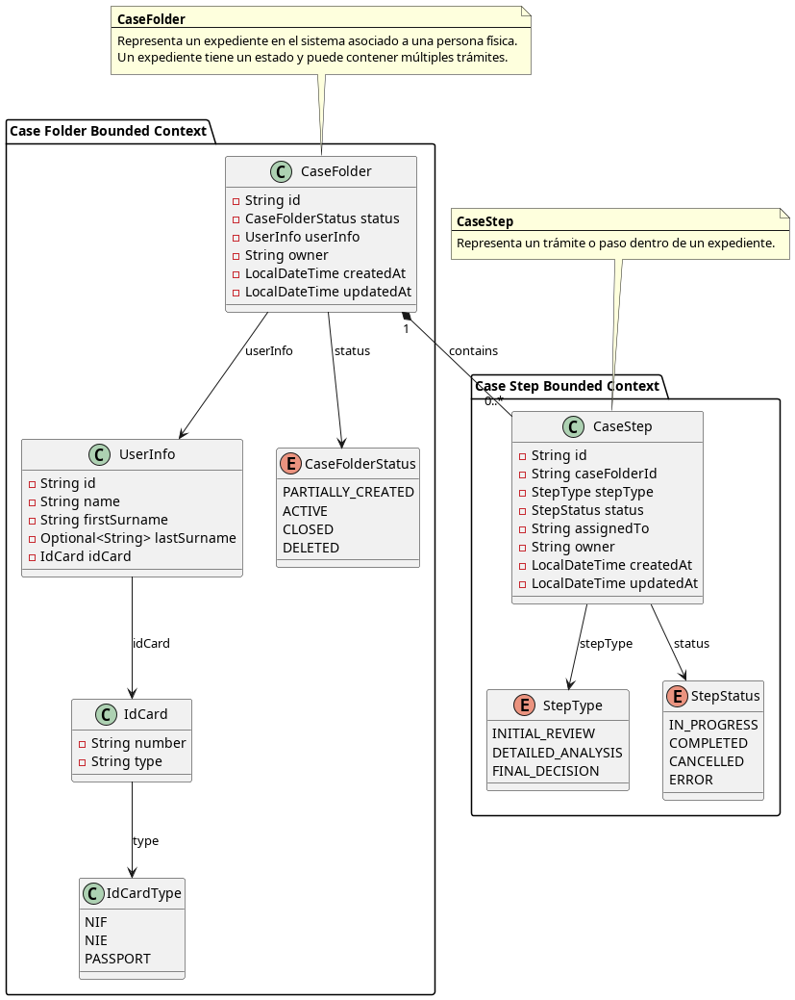
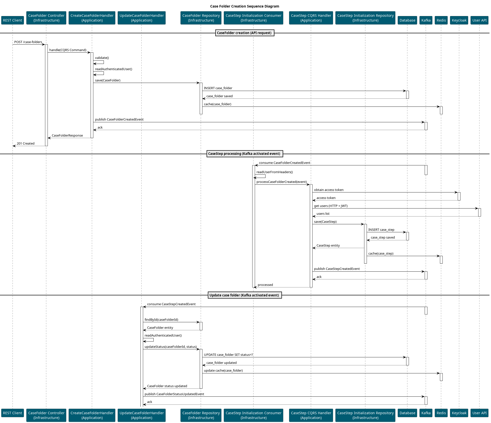
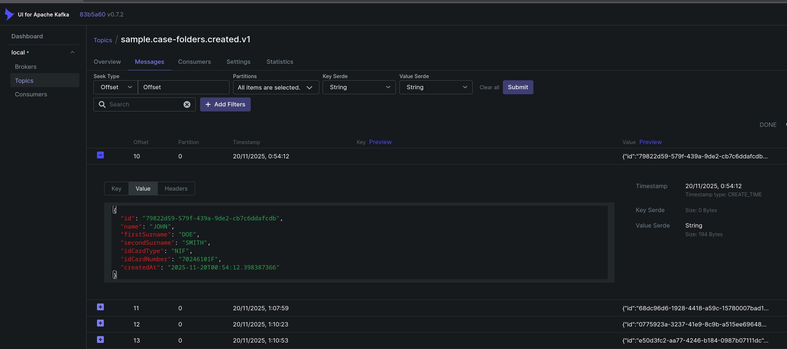
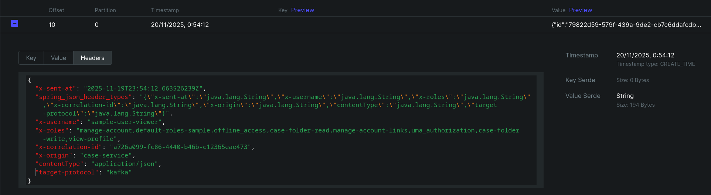
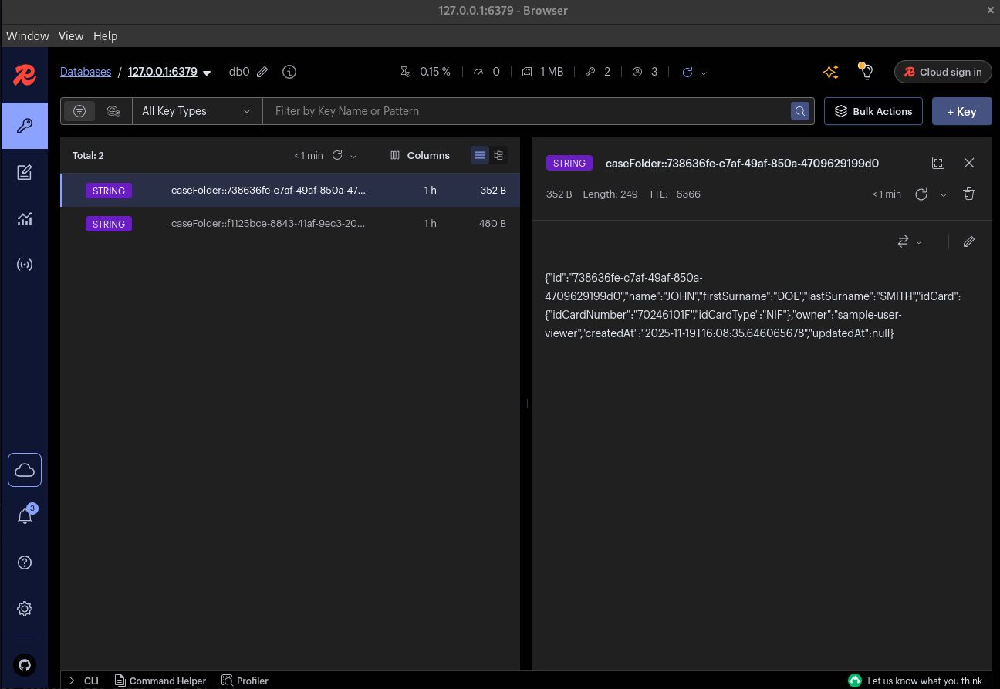
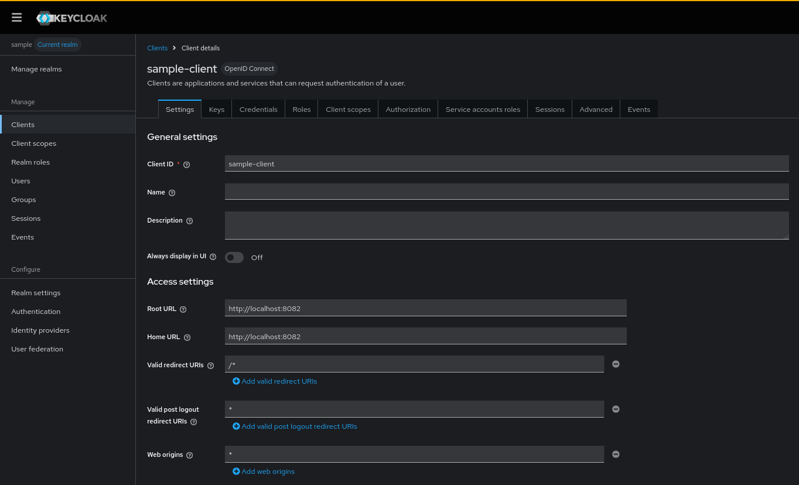
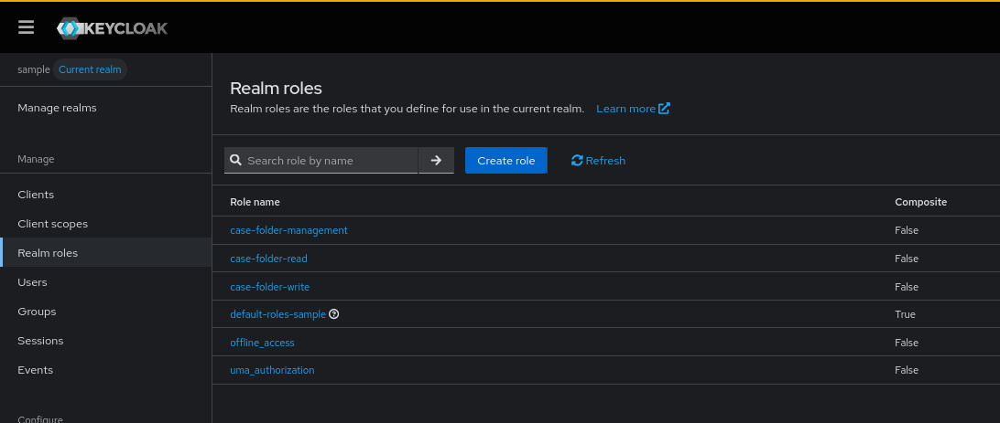

= Prototipo de Arquetipo para Spring Boot con Clean Architecture y Spring Cloud Stream usando Vertical Slices usando Contract-First
:linkattrs:
:icons: font

image:https://img.shields.io/badge/License-GPL3.0-green.svg[License,link="https://www.gnu.org/licenses/gpl-3.0.html"]
image:https://img.shields.io/badge/SpringBoot-3.5.7-green.svg[Spring Boot 3.5.7,link="https://spring.io/projects/spring-boot"]
image:https://img.shields.io/badge/SpringCloudStream-2025.0.0-green.svg[Spring Cloud Stream 2025.0.0,link="https://spring.io/blog/2025/05/29/spring-cloud-2025-0-0-is-abvailable"]
image:https://img.shields.io/badge/Kafka-3.4-green.svg[Kafka 3.4,link="https://kafka.apache.org/34/documentation/"]

++++
<a href="https://www.postman.com/labcabrera/workspace/rmu-engine/collection/5547717-88042a4f-67ac-4676-8077-dc1d64497fb3?action=share&creator=5547717&active-environment=5547717-d961abf9-48b5-43f6-9138-512bd09d0454" target="_blank">
  
</a>
++++

== Introducción

Este proyecto es un prototipo que muestra una aplicación Java Spring Boot diseñada siguiendo principios de link:https://blog.cleancoder.com/uncle-bob/2012/08/13/the-clean-architecture.html[Clean Architecture] y usando link:https://spring.io/projects/spring-cloud-stream[Spring Cloud Stream] para integración con Kafka en un enfoque "vertical slices" (cada módulo contiene sus capas: domain, application, infrastructure e interfaces).

En este ejemplo se implementa una API rest usando el enfoque _Contract First_, definiendo los endpoints y modelos de datos a través de OpenAPI 3.x dentro del fichero link:https://raw.githubusercontent.com/labcabrera/archetype-spring-cloud-stream-vertical-slice-contract-first/refs/heads/develop/src/main/resources/api-definition.yaml[api-definition.yaml] y se utiliza el plugin link:https://plugins.gradle.org/plugin/org.openapi.generator[org.openapi.generator] para generar los DTOs y controladores usando el link:https://openapi-generator.tech/docs/generators/spring/[generador de Spring].

Pretende ser un punto de partida para microservicios que publican y consumen eventos, usando JPA para la persistencia, CQRS para la integración de commands y queries. El prototipo está pensado para equipos de desarrollo que *no estén familiarizados con conceptos de DDD o event sourcing* tales como link:https://www.axoniq.io/framework[Axon] o link:https://eventuate.io/abouteventuatetram.html[Eventuate Tram] y se enfoquen en la implementación de la lógica de  negocio con un enfoque tradicional de servicios.

El prototipo incluye también una configuración de seguridad basada en OAuth2 Resource Server. Las llamadas a la API requieren de un token previamente emitido por un proveedor de identidad que será validado por la aplicación a través de la configuración JWT del IAM.

Adicionalmente se ha integrado un cliente REST basado en Spring Cloud OpenFeign generado a partir de una definición OpenAPIpara consumir una link:https://github.com/labcabrera/sample-user-api[API externa] simulada.

TIP: En el caso de usar un enfoque _Code-First_ tenemos este mismo ejemplo en el siguiente link:https://github.com/labcabrera/archetype-spring-cloud-stream-vertical-slice[repositorio].

== Tecnologías utilizadas

- Spring Boot 3.x (Java 21)
- Spring Data JPA + Hibernate
- link:https://spring.io/projects/spring-cloud-stream[Spring Cloud Stream] + link:https://docs.spring.io/spring-cloud-stream/docs/current/reference/html/spring-cloud-stream-binder-kafka.html[Kafka Binder]
- link:https://spring.io/projects/spring-cloud-openfeign[Spring Cloud OpenFeign] para clientes REST
- link:https://mapstruct.org/[MapStruct] para mapeo de objetos
- link:https://springdoc.org/[Springdoc] para documentación de la API REST
- link:https://github.com/jirutka/rsql-parser[RSQL parser] para filtros en endpoints REST
- link:https://redis.io/[Redis] para cacheo de datos
- link:https://resilience4j.readme.io/docs/getting-started[Resilience4j] para tolerancia a fallos en el cliente REST
- link:https://micrometer.io/[Micrometer] / link:https://docs.spring.io/spring-boot/reference/actuator/index.html[Actuator] para métricas y monitorización

== Estructura del proyecto

En este proyecto de ejemplo tendremos dos módulos verticales principales: _casefolder_ (expedientes) y _casestep_ (trámites), además de un módulo _shared_ para código común.

TIP: El contenido del módulo _shared_ podría extraerse a módulos externos autoconfigurables equivalentes a los starters de Spring Boot para compartir entre proyectos.

El módulo _casefolder_ define la lógica de un expediente, en este ejemplo un CRUD básico y la publicación de eventos.

El módulo _casestep_ define la lógica de un trámite. Un expediente podrá tener N trámites asociados, y este módulo consume eventos de creación de expedientes para iniciar los trámites correspondientes. De cara a este ejemplo se ha desnormalizado el modelo para que cada trámite tenga una referencia al expediente al que pertenece sin utilizar joins entre tablas de diferentes módulos.

TIP: En un escenario real, los módulos podrían estar desplegados como microservicios independientes comunicándose a través de eventos, cada uno correspondiendo a un boundary context diferente. Usando un enfoque de agregados podríamos hacer que el _CaseFolder_ sea el root del agregado y los _CaseStep_ entidades dependientes.



La estructura de los verticales del proyecto es la siguiente:

----
src/
 ├── org/labcabrera/sample/archetype
 │   ├── casefolder
 │   ├── casestep
 │   └── shared
----


El flujo de alta de expediente es el siguiente:



Dentro de cada módulo vertical, seguimos la estructura típica de Clean Architecture:

----
module/
 ├── domain
 ├── application
 ├── infrastructure
 └── interfaces
----

- *domain*: entidades de dominio y lógica de negocio pura.
- *application*: casos de uso y servicios que orquestan la lógica de negocio. En estos se encuentran los handlers CQRS, servicios de aplicación y puertos (interfaces) hacia infraestructuras externas.
- *infrastructure*: adaptadores hacia infraestructuras externas (JPA, Kafka, mappers).
- *interfaces*: adaptadores de entrada (controladores HTTP, consumidores/productores de Spring Cloud Stream).

TIP: La configuración que se encuentra en `src/main/resources/` podría resolverse externamente a través de un servidor de configuración, por ejemplo Spring Cloud Config Server.

== Cómo compilar y ejecutar

Compilar:

```bash
./gradlew clean build
```

Después levantaremos los servicios locales a través de docker compose ejecutando:

----
docker-compose -f docker-compose/docker-compose.yaml up -d
----

Esto arrancará las instancias utilizadas por la aplicación:

- Kafka
- PostgreSQL
- Redis
- Keycloak

NOTE: Asegúrate de tener Docker y Docker Compose instalados en tu máquina y haber creado la red `sample-network` previamente con `docker network create sample-network`

Una vez estén levantados los servicios, podemos ejecutar la aplicación localmente usando el siguiente comando desde la raíz del proyecto:

----
java -jar build/libs/*.jar
----

== Notas sobre la implementación

=== Spring Cloud Stream

Se ha utilizado Spring Cloud Stream con Kafka binder para la integración basada en eventos. Los consumidores y productores están definidos como beans `@Bean` de tipo `Consumer`.

Dentro de la configuración realizamos el mapeo de los bindings a destinos Kafka específicos y grupos de consumidores:

[source,yaml]
----
spring:
  cloud:
    function:
      definition: onCaseFolderCreation;onCaseFolderCreated;onCaseFolderDeleted;onCaseStepCreated
    stream:
      bindings:
        # input bindings
        onCaseFolderCreation-in-0:
          destination: sample.case-folders.creation.v1
          group: case-folders-svc
          contentType: application/json
        # output bindings
        caseFolderCreated-out-0:
          destination: sample.case-folders.created.v1
          contentType: application/json
        # ...
      kafka:
        binder:
          brokers: ${KAFKA_BROKERS:localhost:9092}
          autoCreateTopics: true
          minPartitionCount: 1

----

Esta configuración realiza el binding automático de los consumidores y productores a los topics Kafka correspondientes por ejemplo en nuestro controlador de Kafka:

[source,java]
----
@Configuration
@RequiredArgsConstructor
public class KafkaCaseFolderController {

    private final CommandBus commandBus;

    @Bean
    public Consumer<CreateCaseFolderCommand> processCaseFolderCreation() {
        return command -> commandBus.dispatch(command);
    }
}
----



En este ejemplo los topics se consideran seguros (la publicación de los eventos es interna) de tal modo que se utilizan cabeceras de Kafka para propagar la información de seguridad del usuario autenticado a través de los mensajes. En otros escenarios podríamos utilizar el mismo esquema de seguridad basado en OAuth2 para proteger los topics a través de tokens.



TIP: Usando Spring Cloud Stream evitamos que nuestro código tenga dependencias directas con la API de Kafka de modo que puede ser fácilmente adaptado a otros sistemas de mensajería compatibles con Spring Cloud Stream como por ejemplo RabbitMQ, AWS SQS, etc, cambiando únicamente las dependencias y el fichero de configuración.

==== Gestión de errores y reintentos

A través de la configuración de Spring Cloud Stream podemos definir las políticas de reintento como por ejemplo:

[source,yaml]
----
spring:
  cloud:
    stream:
      bindings:
        onCaseFolderCreated-in-0:
          destination: sample.case-folders.created.v1
          group: case-folders-svc
          contentType: application/json
          consumer:
            max-attempts: 3
            back-off-initial-interval: 500
            back-off-max-interval: 10000
            back-off-multiplier: 2.0
            default-retryable: true
            retryable-exceptions:
              org.labcabrera.sample.archetype.shared.domain.exceptions.BadRequestException: false
----

Donde podemos configurar el número máximo de reintentos, el intervalo entre reintentos y las excepciones que consideramos retryables o no. En este ejemplo haremos tres reintentos exponenciales empezando en 500ms y llegando hasta 10s. Además, las excepciones de tipo `BadRequestException` no serán reintentadas.

También podemos configurar una Dead Letter Queue (DLQ) para los mensajes que no se han podido procesar tras los reintentos:

[source,yaml]
----
spring:
  cloud:
    function:
      definition: onCaseFolderCreation;onCaseFolderCreated;onCaseFolderDeleted;onCaseStepCreated
    stream:
      # ...
      kafka:
        binder:
          brokers: ${KAFKA_BROKERS:localhost:9092}
          autoCreateTopics: true
          minPartitionCount: 1
        bindings:
          onCaseFolderCreated-in-0:
            consumer:
              enable-dlq: true
              dlq-name: sample.case-folders.created.dlq.v1
              dlq-partitions: 1
----

En este caso, si después de los reintentos el mensaje no se ha podido procesar, será enviado al topic `sample.case-folders.created.dlq.v1` para su posterior análisis o tratamiento.

=== Seguridad

==== OAuth2 Resource Server

Se ha configurado la aplicación como un OAuth2 Resource Server que valida tokens JWT emitidos por un proveedor de identidad (IdP) como Keycloak usando la librería _spring-boot-starter-oauth2-resource-server_.

De este modo la aplicación recibe un token JWT en las peticiones HTTP y lo valida para autorizar el acceso a los endpoints protegidos. Para la validación de la firma del token se utiliza el almacén JWK del IAM a través de la configuración definida en _application-security.yaml_:

[source,yaml]
----
spring:
  security:
    oauth2:
      resourceserver:
        jwt:
          jwk-set-uri: ${IAM_JWK_URI:http://localhost:8090/realms/sample/protocol/openid-connect/certs}
----

==== Restricciones de acceso en entidades de dominio

En la capa de aplicación se ha definido la interface _Guard_ encargada de verificar las restricciones de acceso a nivel de entidad de dominio:

[source,java]
----
public interface Guard<T> {
    void checkRead(T domain, AuthenticatedUser user);
    void checkWrite(T domain, AuthenticatedUser user);
    void checkCreate(AuthenticatedUser user);
}
----

Cada entidad de dominio puede tener su propia implementación de _Guard_ que será invocada desde los servicios de aplicación para verificar si el usuario autenticado tiene permisos para realizar la operación solicitada.
En este ejemplo, la implementación de _Guard_ para la entidad _CaseFolder_ verifica a nivel de los roles obtenidos del IAM y en los casos de no ser administrador de que el campo _owner_ coincida con el usuario autenticado. En otros escenarios podremos implementar lógicas más complejas según las necesidades de seguridad de la aplicación.

==== Filtros en las consultas RSQL

Dentro de la implementación del repositorio JPA para la entidad _CaseFolder_ se ha añadido un filtro de seguridad en las consultas RSQL para limitar los resultados según los permisos del usuario autenticado:

[source,java]
----
    @Override
    public Page<CaseFolder> findByRsql(String rsql, Pageable pageable, AuthenticatedUser user) {
        Specification<CaseFolderEntity> authSpec = (root, query, cb) -> {
            if (!user.hasRole(CaseFolderGuard.ROLE_CASE_FOLDER_MANAGEMENT)) {
                return cb.equal(root.get("owner"), user.username());
            }
            return cb.conjunction();
        };
        if (StringUtils.isBlank(rsql)) {
            var page = jpaRepository.findAll(authSpec, pageable);
            return page.map(entity -> mapper.toDomain(entity));
        }
        try {
            Node rootNode = rsqlParser.parse(rsql);
            Specification<CaseFolderEntity> spec = rootNode.accept(new CustomRsqlVisitor<CaseFolderEntity>());
            Specification<CaseFolderEntity> finalSpec = (spec == null) ? authSpec : spec.and(authSpec);
            var page = jpaRepository.findAll(finalSpec, pageable);
            return page.map(entity -> mapper.toDomain(entity));
        }
        catch (Exception ex) {
            throw new BadRequestException("rsql.msg.err.parse", ex, rsql);
        }
    }
----

De este modo, si el usuario no tiene el rol de administración, solo podrá ver los expedientes que él mismo es propietario. Si habilitamos el logging de SQL podremos ver como se añade la condición adicional en la consulta _name=re=JO_ generada por Hibernate:

----
2025-11-19 15:53:09.853 [http-nio-8082-exec-9] DEBUG org.hibernate.SQL - 
    select
        cfe1_0.id,
        cfe1_0.created_at,
        cfe1_0.first_surname,
        cfe1_0.id_card_number,
        cfe1_0.id_card_type,
        cfe1_0.last_surname,
        cfe1_0.name,
        cfe1_0.owner,
        cfe1_0.updated_at,
        cfe1_0.version 
    from
        case_folder cfe1_0 
    where
        cfe1_0.name like ? escape '' 
        and cfe1_0.owner=? 
    offset
        ? rows 
    fetch
        first ? rows only
2025-11-19 15:53:09.853 [http-nio-8082-exec-9] TRACE org.hibernate.orm.jdbc.bind - binding parameter (1:VARCHAR) <- [%JO%]
2025-11-19 15:53:09.853 [http-nio-8082-exec-9] TRACE org.hibernate.orm.jdbc.bind - binding parameter (2:VARCHAR) <- [sample-user-viewer]
2025-11-19 15:53:09.853 [http-nio-8082-exec-9] TRACE org.hibernate.orm.jdbc.bind - binding parameter (3:INTEGER) <- [0]
2025-11-19 15:53:09.853 [http-nio-8082-exec-9] TRACE org.hibernate.orm.jdbc.bind - binding parameter (4:INTEGER) <- [10]
----

=== RSQL

Se ha utilizado la libreria link:https://github.com/jirutka/rsql-parser[rsql-parser] para parsear filtros RSQL en endpoints REST. Esto permite construir queries dinámicas basadas en parámetros de consulta.

Se ha añadido el operador `=re=` para búsquedas "contiene" (like %value%) en strings.

La implementación del visitor personalizado `CustomRsqlVisitor` realiza el mapeo de los nodos RSQL a especificaciones JPA y nos permite combinar
búsqueda dentro de entidades relacionadas, por ejemplo:

----
userInfo.idCard.idCardNumber==50537477Z
----

Donde _userInfo_ está mapeado como un _@ManyToOne_ dentro de _CaseFolderEntity_ y _idCard_ es un _@Embedded_ dentro de _UserInfoEntity_.

=== CQRS

Se ha adoptado un enfoque CQRS básico en la capa de aplicación, separando comandos (modificaciones de estado) y consultas (lecturas). Cada comando tiene su propio handler que encapsula la lógica de negocio asociada.

Este enfoque nos permite trabajar con los manejadores como si fueran los casos de uso de la aplicación, recibiendo comandos y queries con los datos necesarios.

En lugar de utilizar una implementación compleja de bus de comandos (por ejemplo Axon), se ha optado por un enfoque simple basado en servicios Spring gestionados por el contenedor de IoC.

Dentro del _application.cqrs_ de cada vertical establecemos la estructura:

----
{module}.application/
    ├── cqrs
    │   ├── commands: definición de comandos
    |   |── handlers: implementación de manejadores de comandos y queries
    │   └── queries: definición de queries
----

=== Clientes Feign

En este ejemplo se ha utilizado Spring Cloud OpenFeign para la comunicación con una API REST externa simulada.

Para ello se ha utilizado el mismo plugin de generación de OpenAPI para generar el cliente Feign a partir de la definición OpenAPI 3.0 de la API externa añadiendo la siguiente configuración en el fichero _build.gradle_:

[source,groovy]
----
tasks.register('openApiGenerateUserApi', org.openapitools.generator.gradle.plugin.tasks.GenerateTask) {
	generatorName = 'java'
	library = "feign"
	inputSpec = "$rootDir/src/main/resources/api-clients/user-api.yaml"
	outputDir = "$buildDir/generated/sources/openapi/user-client"
	apiPackage = 'org.labcabrera.sample.archetype.generated.client.user.api'
	modelPackage = 'org.labcabrera.sample.archetype.generated.client.user.model'
	invokerPackage = 'org.labcabrera.sample.archetype.generated.client.user'
	configOptions = [
		useSpringBoot3: 'true',
		interfaceOnly: 'true',
		useFeignClientUrls: 'true',
		useFeignClientContextId: 'true',
		useTags: 'true',
		dateLibrary: 'java8',
		useJakartaEe: 'true',
		openApiNullable: 'false',
	]
	additionalProperties = [
		serializableModel: 'true'
	]
}
----

Nuestra API está securizada del mismo modo que este proyecto de ejemplo de modo que para consumirla utilizaremos un token generado a partir `grant_type=password` con los credenciales de nuestra aplicación.

Después, al crear la instancia de nuestro _ApiClient_ configuramos el interceptor de Feign para añadir el token a las peticiones:

[source,java]
----
    UsersClientProperties.Oauth o = properties.getOauth();
    OauthPasswordGrant oauth = new OauthPasswordGrant(o.getTokenUrl(), o.getScopes());
    oauth.configure(o.getUsername(), o.getPassword(), o.getClientId(), o.getClientSecret());
    apiClient.addAuthorization(properties.getAuthName(), oauth);
    apiClient.registerAccessTokenListener(token ->
        log.info("Users client obtained access token (expiresIn={}s)", token.getExpiresIn()));
----

=== Springdoc

En este caso el enfoque REST es _Contract-First_, por lo que las definiciones de los endpoints y modelos de datos se encuentran en el fichero _api-definition.yaml_.

Se ha utilizado la librería link:https://springdoc.org/[Springdoc OpenAPI] para generar la documentación de la API REST basada en OpenAPI 3.0.

La configuración del plugin de Gradle utilizada es:

[source,groovy]
----
openApiGenerate {
    generatorName = "spring"
    inputSpec = "$projectDir/src/main/resources/api-definition.yaml"
    outputDir = "$buildDir/generated/openapi"
    apiPackage = "org.labcabrera.sample.archetype.interfaces.api"
    modelPackage = "org.labcabrera.sample.archetype.interfaces.model"
    configOptions = [
        interfaceOnly: "true",
        dateLibrary: "java8",
        useBeanValidation: "true",
        library: "spring-boot",
        delegatePattern: "true",
        useOptional: "true",
        performBeanValidation: "true"
    ]
}
----

Dentro de cada vertical, los controladores REST extienden de las interfaces generadas por Springdoc y se implementan los métodos correspondientes mapeando los objetos del dominio a los DTOs generados usando MapStruct.

=== Mapeo de campos

Para los mapeos de nuestro objeto de dominio con las entidades JPA y los DTOs de nuestra capa de exposición REST utilizamos MapStruct. Este mapeador genera código en tiempo de compilación para realizar las conversiones de manera eficiente.

Para ello, primeramente definimos en el fichero gradle la configuración necesaria para que MapStruct genere el código:

[source]
----
tasks.withType(JavaCompile).configureEach {
  options.annotationProcessorGeneratedSourcesDirectory = file("$buildDir/generated/sources/annotations")
  options.compilerArgs += ["-Amapstruct.defaultComponentModel=spring"]
}
----

Y después definimos los mapeadores como interfaces anotadas con `@Mapper`:

[source,java]
----
@Mapper
public interface CaseFolderMapper {
    CaseFolder toDomainEntity(CreateCaseFolderCommand command);
    CaseFolderDTO toDTO(CaseFolder entity);
}
----

=== Validation

Este prototipo integra Bean Validation (`jakarta.validation`) para validar tanto nuestros objetos de dominio como los DTOs de nuestra capa de exposición REST.

En nuestros servicios podremos inyectar un validador y utilizarlo para validar las entidades antes de persistirlas o procesarlas:

[source,java]
----
public class CreateCaseFolderCommandHandler implements CommandHandler<CreateCaseFolderCommand, CaseFolder> {


    public CaseFolder handle(CreateCaseFolderCommand command) {
        // ...
        validateCaseFolder(caseFolder);
        // ...
    }

    private void validateCaseFolder(CaseFolder caseFolder) {
        Set<ConstraintViolation<CaseFolder>> violations = validator.validate(caseFolder);
        if (!violations.isEmpty()) {
            throw new ValidationException("casefolder.msg.err.validation", violations);
        }
    }
}
----

En nuestra capa de exposición REST, podemos utilizar la anotación `@Validated` en los controladores para validar automáticamente los DTOs entrantes:

[source,java]
----
@Override
    public ResponseEntity<CaseFolderDto> create(@RequestBody @Validated CreateCaseFolderRequest request) {
        var command = buildCommand(request);
        var playerDto = mapper.toDto(caseFolder);
        return ResponseEntity.status(201).body(playerDto);
    }
----

En caso de violaciones de las restricciones, se lanzará una excepción `ValidationException` que será manejada por el controlador de excepciones global para devolver una respuesta HTTP adecuada.

=== Coreogragrafía SAGA

En este prototipo se ha implementado un flujo básico de coreografía de eventos entre los módulos _casefolder_ y _casestep_ basada en estados. Cuando se crea un expediente (_casefolder_), se publica un evento `CaseFolderCreatedEvent` que es consumido por el módulo _casestep_ para iniciar los trámites asociados.

Cuando se termina de crear el trámite, se publica un evento `CaseStepCreatedEvent` que es consumido por el módulo _casefolder_ para actualizar el estado del expediente.

=== Gestión de errores

Los errores de la aplicación se manejan extendiendo de _DomainException_.

En la capa de infraestructura REST se ha agregado un _@RestControllerAdvice_ que se encarga de capturar las excepciones lanzadas por los controladores y devolver respuestas HTTP adecuadas con códigos de estado y mensajes de error.

=== Cacheo con Redis

Se ha integrado Redis como sistema de cacheo para mejorar el rendimiento de las consultas frecuentes. La configuración de Redis se encuentra en el archivo `application-cache.yaml`.

La configuración de la caché se realiza a través de la clase `CacheConfiguration`, donde se define un `RedisCacheManager` que utiliza un serializador JSON personalizado para almacenar los objetos en Redis.

Se han activado las anotaciones de caché en la implementación del repositorio de consultas:

[source,java]
----
    @Override
    @Cacheable(value = "caseFolder", key = "#caseFolderId", unless = "#result == null || #result.isEmpty()")
    public Optional<CaseFolder> findById(String caseFolderId) {
        return jpaRepository.findById(caseFolderId).map(entity -> mapper.toDomain(entity));
    }
----

Añadiendo las anotaciones `@Cacheable`, `@CachePut` y `@CacheEvict` en los métodos correspondientes para gestionar el almacenamiento, actualización y eliminación de entradas en la caché.

Si accedemos a la consola de Redis podemos ver que las entradas se almacenan correctamente serializadas en JSON:



=== Resilience4j

En este ejemplo se ha integrado un ejemplo básico de Circuit Breaker utilizando la librería link:https://resilience4j.readme.io/docs[Resilience4j] para mejorar la tolerancia a fallos en las llamadas al cliente Feign que consume la API externa.

En el método que consume la API externa se ha añadido la anotación `@CircuitBreaker` para definir el comportamiento del circuito:

[source,java]
----
public class UserClientAdapter implements UserClientPort {

    @CircuitBreaker(name = "cbUserApi", fallbackMethod = "getAssignedUserFallback")
    public String getAssignedUser(StepType stepType) {
        // Llamada al cliente Feign
    }

    public String getAssignedUserFallback(StepType stepType, Throwable ex) {
        // Lógica de fallback en caso de fallo
    }
}
----

Después utilizamos la configuración de Resilience4j para definir los parámetros del circuito en el archivo `application-resilience4j.yaml`:

[source,yaml]
----
resilience4j:
  circuitbreaker:
    instances:
      cbUserApi:
        sliding-window-type: COUNT_BASED
        sliding-window-size: 5
        failure-rate-threshold: 50
        wait-duration-in-open-state: 60s
        permitted-number-of-calls-in-half-open-state: 3
        automatic-transition-from-open-to-half-open-enabled: true
----

=== I18n

Los mensajes de error y validación se han externalizado en archivos de propiedades para facilitar la internacionalización (i18n). Actualmente solo está el archivo `messages.properties` en inglés, pero se pueden agregar más archivos para otros idiomas.

El manejo de mensajes de realiza a través de la interfaz Spring MessageSource que permite cargar los mensajes según la configuración regional del cliente.

A través de la propiedad HTTP _Accept-Language_ se puede especificar el idioma preferido para las respuestas.

== Observabilidad

En el proyecto se ha incluido soporte para métricas y monitorización utilizando Spring Boot Actuator y Micrometer con Prometheus como backend.

Se ha creado un _port_ para la definición de las métricas personalizadas y un adapter basado en Micrometer:

[source,java]
----
public class CaseFolderMetricAdapter implements CaseFolderMetricPort {

    private final Counter caseFolderCreatedCounter;
    private final Counter caseFolderUpdatedCounter;
    private final Counter caseFolderDeletedCounter;

    public CaseFolderMetricAdapter(MeterRegistry meterRegistry) {
        caseFolderCreatedCounter = Counter.builder("casefoldercreated")
            .description("Number of case folders created")
            .register(meterRegistry);
        caseFolderUpdatedCounter = Counter.builder("casefolderupdated")
            .description("Number of case folders updated")
            .register(meterRegistry);
        caseFolderDeletedCounter = Counter.builder("casefolderdeleted")
            .description("Number of case folders deleted")
            .register(meterRegistry);
    }

    @Override
    public void incrementCaseFolderCreatedCounter() {
        caseFolderCreatedCounter.increment();
    }

    // ...
}
----

De este modo cada vez que se crea un expediente, se incrementa el contador `casefoldercreated` y el endpoint de prometheus registrará esta métrica devolviendo:

----
# HELP casefoldercreated_total Number of case folders created
# TYPE casefoldercreated_total counter
casefoldercreated_total 1.0
----

== IAM

En este ejemplo se ha utilizado Keycloak como proveedor de identidad (IAM) para gestionar la autenticación y autorización de los usuarios. Dentro del docker-compose se levanta una instancia de Keycloak sin configuración previa.

Tendremos que acceder a la consola de administración de Keycloak en `http://localhost:8090/` y crear un realm llamado `sample`.

Una vez creado el realm debemos crear un cliente llamado `sample-client` con los siguientes ajustes con "Client authentication enabled" y "Authorization enabled".



Después crearemos los roles utilizados por este ejemplo:



Y finalmente crearemos dos usuarios, uno con el rol de manager y otro sólamente con los roles de _reader/writer_.

== Sonar

Para ejecutar el análisis de SonarQube deberemos crear un token en nuestra instancia de SonarQube y exportarlo como variable de entorno `SONAR_TOKEN`. Después ejecutamos el siguiente comando:

----
./gradlew sonarqube -Dsonar.token=${SONAR_TOKEN}
----

== Referencias

- link:https://spring.io/projects/spring-boot[Spring Boot]
- link:https://spring.io/projects/spring-cloud-stream[Spring Cloud Stream]
- link:https://spring.io/projects/spring-cloud-openfeign[Spring Cloud OpenFeign]
- link:https://8thlight.com/blog/uncle-bob/2012/08/13/the-clean-architecture.html[Clean Architecture]
- link:https://mapstruct.org/[MapStruct]
- link:https://github.com/jirutka/rsql-parser[RSQL Parser]
- link:https://redis.io//[Redis]
- link:https://micrometer.io/[Micrometer]
- link:https://www.testcontainers.org/[Testcontainers]
- link:https://oas-validation.com/[OpenAPI Specification Validator]
- link:https://openapi-generator.tech/docs/generators/spring/[OpenAPI Generator - Spring]